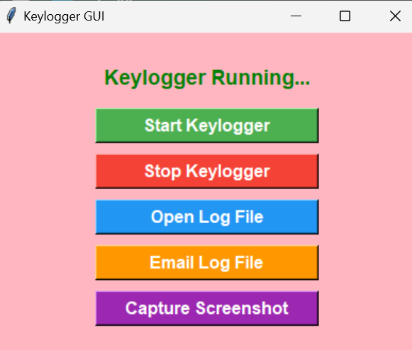
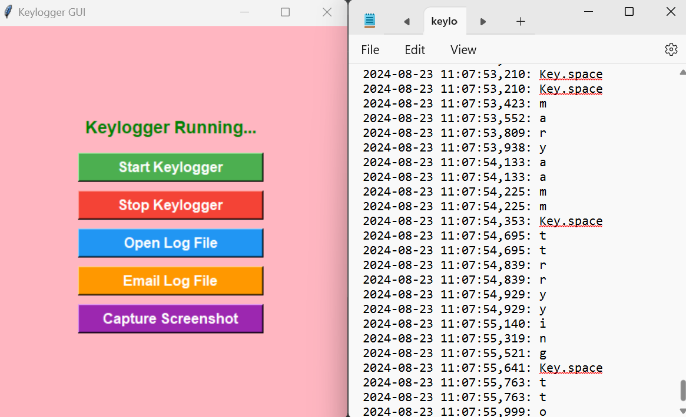
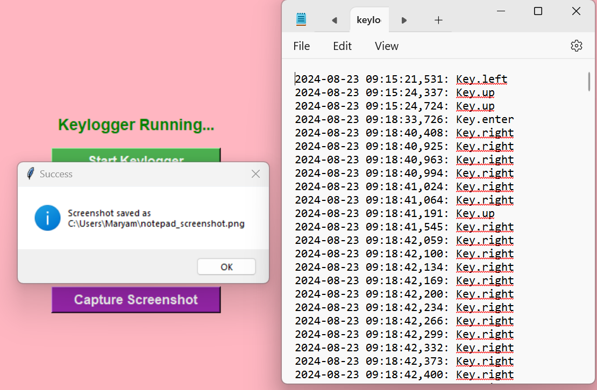
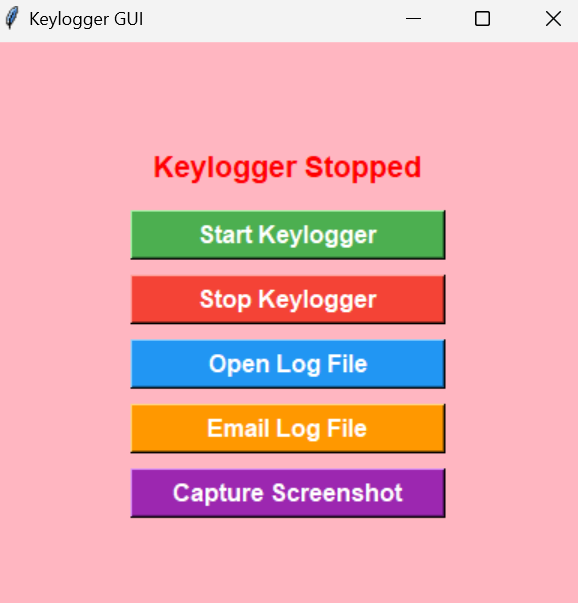

# Keylogger-Software

**Keylogger-Software** is a Python-based application designed to demonstrate comprehensive logging capabilities. This tool captures keystrokes, manages logs, sends email reports, and takes screenshots. It showcases proficiency in Python, GUI development with Tkinter, and integration with various libraries.

## 🚀 Features

- **Keystroke Logging**: Efficiently logs all keystrokes into a text file.
- **Log File Management**: Easy access to the log file with a built-in viewer.
- **Email Functionality**: Seamless email sending with log attachment via SMTP.
- **Screenshot Capture**: Saves screenshots to a specified directory at user command.
- **User-Friendly GUI**: Intuitive interface for controlling the keylogger and managing outputs.

## 📸 Screenshots

Visualize the Keylogger-Software with the following screenshots:

<p align="center">
  
  <br/><i>Keylogger is running.</i>
</p>

<p align="center">
  
  <br/><i>Viewing the log file.</i>
</p>

<p align="center">
  
  <br/><i>Capturing screenshots.</i>
</p>

<p align="center">
  
  <br/><i>Stopping the keylogger.</i>
</p>

## 🛠️ Installation & Setup

1. **Clone the Repository**:
    ```sh
    git clone https://github.com/MaryamFatima16/Keylogger-Software.git
    cd Keylogger-Software
    ```

2. **Install Required Packages**:
    Make sure you have Python installed, then install the required Python packages:
    ```sh
    pip install pynput pillow tk
    ```

3. **Configure Email Settings**:
    Update email credentials and SMTP server settings in the `send_email()` function of `keylogger.py`:
    ```python
    msg['From'] = 'your-email@gmail.com'
    msg['To'] = 'receiver-email@gmail.com'
    server.login('your-email@gmail.com', 'your-email-password')
    ```

4. **Define Screenshot Directory**:
    Update the `screenshot_dir` variable in `keylogger.py` to your desired directory for saving screenshots.

## 🏗️ Usage

1. **Start Logging**:
    Click "Start Keylogger" to begin capturing keystrokes.

2. **Stop Logging**:
    Click "Stop Keylogger" to end the logging session.

3. **View Logs**:
    Use "Open Log File" to view logs in Notepad.

4. **Email Logs**:
    Click "Email Log File" to send logs via email.

5. **Capture Screenshots**:
    Click "Capture Screenshot" to save a screenshot.

## 🔧 Customization

- **Changing Log File Location**: Modify the `log_file` path in the code.
- **Adjusting Screenshot Directory**: Update `screenshot_dir` to your preferred directory.
- **Modifying GUI**: Customize the GUI appearance and functionality through Tkinter settings.

## 🎯 Use Cases

- **Security Monitoring**: Keep track of keystrokes and capture unauthorized activities.
- **User Behavior Analysis**: Analyze user interactions for research purposes.
- **Debugging & Testing**: Test and debug user inputs in applications.

## 📝 Roadmap

Upcoming Features:
- Integration with cloud storage for log backups.
- Enhanced encryption for log files and screenshots.
- More customizable GUI options.

## 💬 Feedback & Contribution

Your feedback and contributions are welcome! Feel free to fork this repository, open issues, or submit pull requests to enhance functionality.

## 🧩 License

This project is licensed under the MIT License - see the [LICENSE](LICENSE) file for details.

## 📫 Contact

Maryam Fatima  
[GitHub Profile](https://github.com/MaryamFatima16)  
[LinkedIn Profile](https://www.linkedin.com/in/maryam-fatima03)  
Email: [your-email@gmail.com](maryamfatima03@gmail.com)
